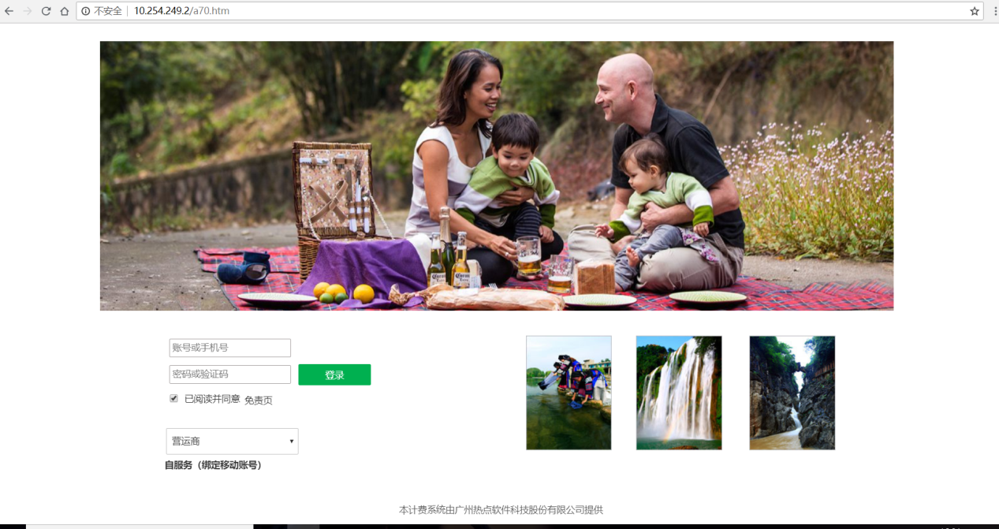
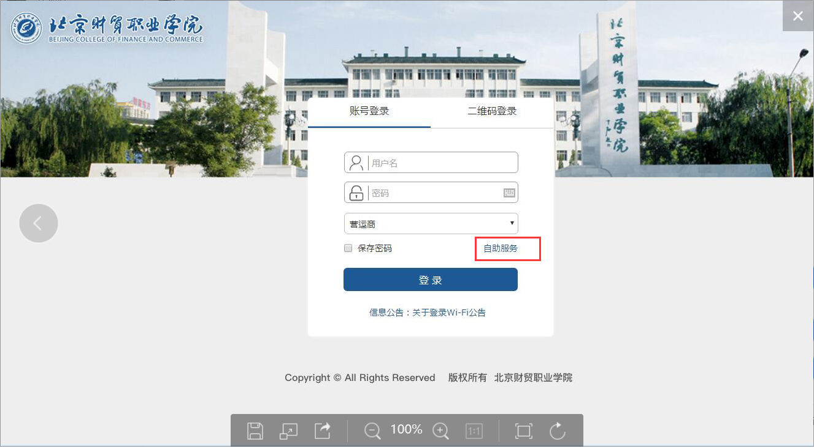
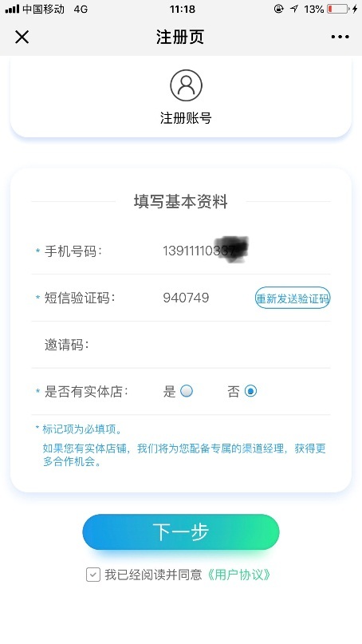
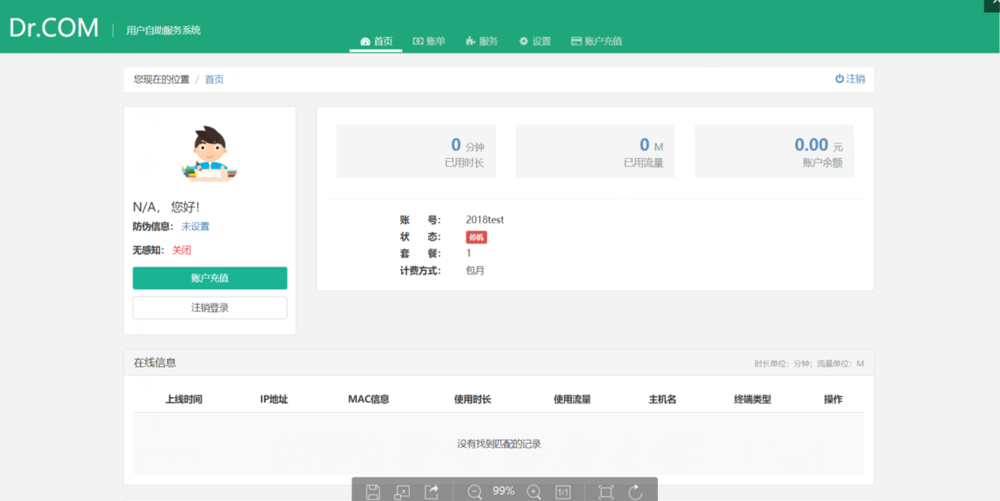
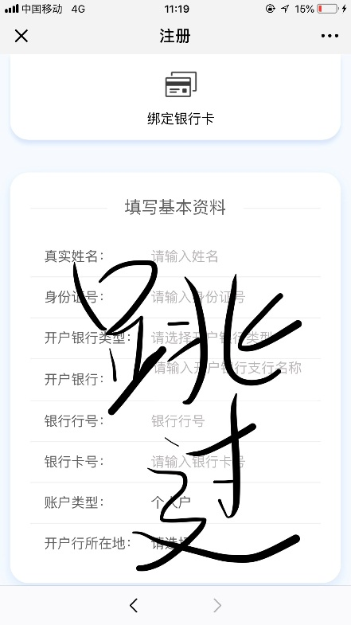
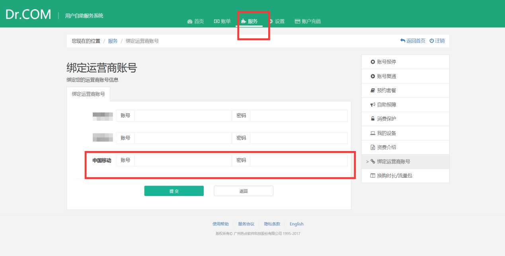
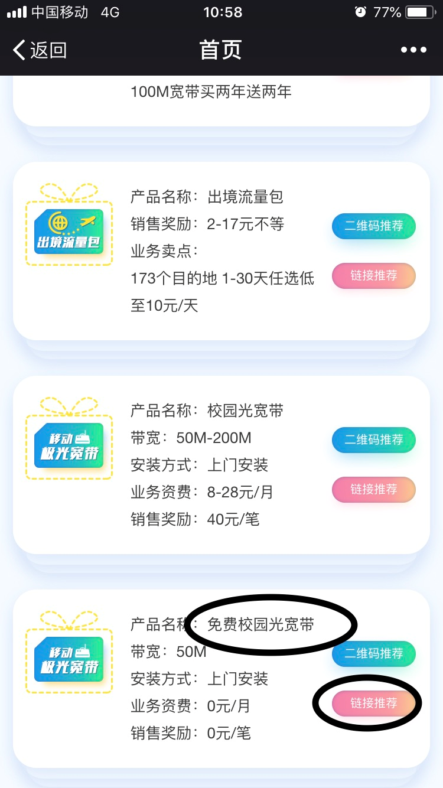

## 北京财贸学院移动宽带使用手册

- **第1步** 连接网线，打开网页，自动跳转登陆界面

- **第2步** 用户第一次登陆，需要选择自助服务绑定移动账号

- **第3步** 点击自助服务后跳转界面

- **第4步** 用校园账号和密码登陆自助服务系统

- **第5步** 登陆后点击“服务”选项中的“绑定运营商账号按钮”

- **第6步** 添加自己的移动账号和密码进行绑定

- **第7步** 绑定成功后返回登陆页面，输入校园账号密码后，点击下面的选择运营商，选择中国移动，就可使用中国移动网络登陆校园网。

### FAQ
1. 能否在多终端登录？
  答：不能。
2. 是否有线和无线都能用？
  答：都能，不能同时用。
3. 如何销号并取消宽带？
  答：请前往营业厅办理业务。
4. 没有移动校园卡能否办理移动校园宽带？
  答：不能，请先办理移动“200打一年校园卡”

比校园网更快的移动校园网络， 校园卡用户开通免费宽带请扫码：

