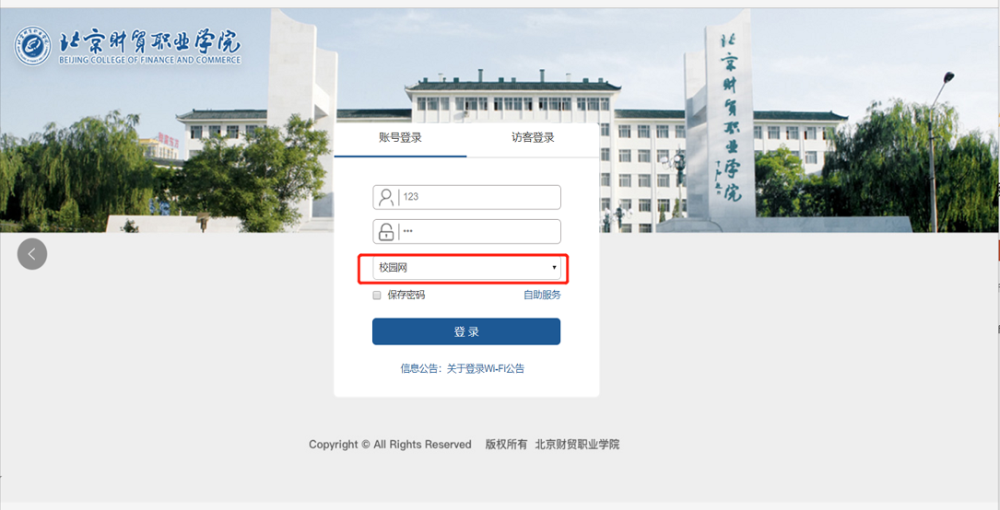
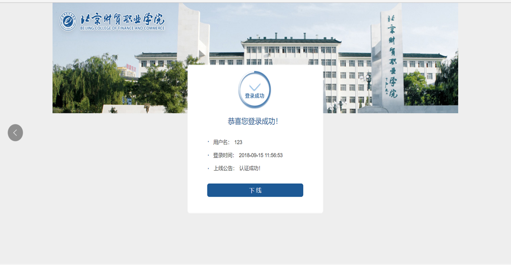
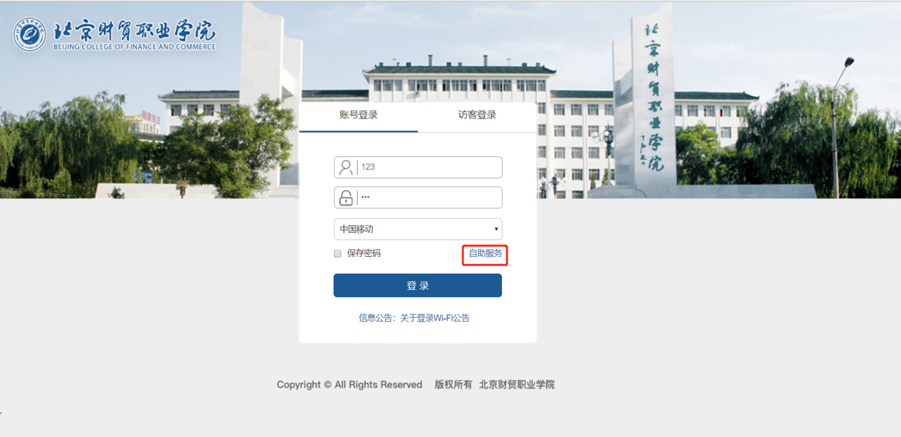
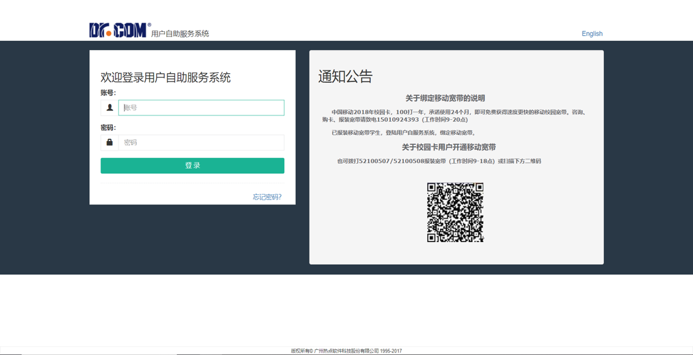
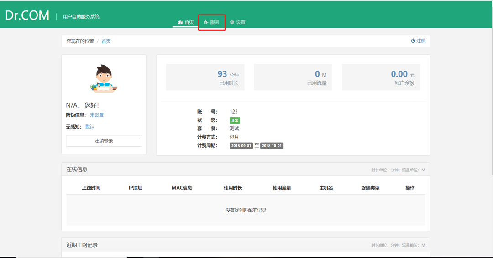
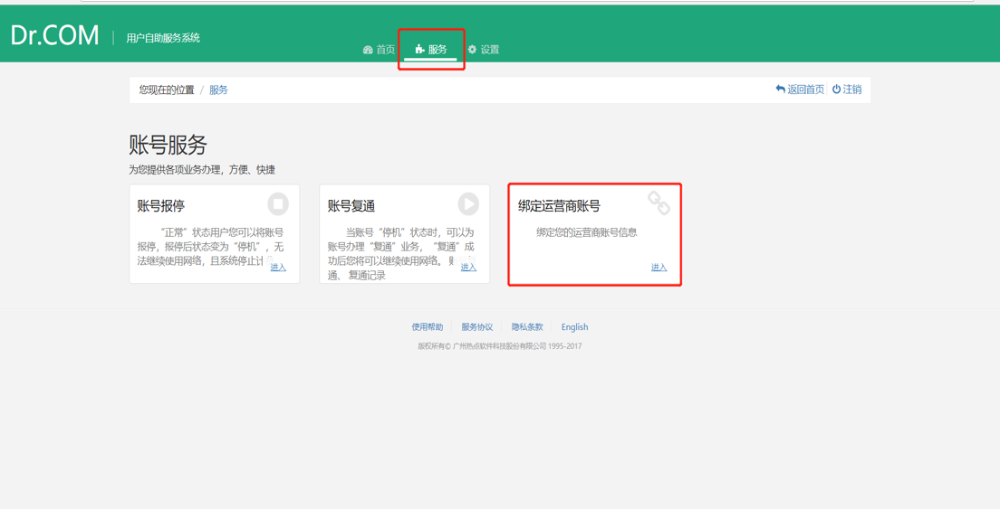
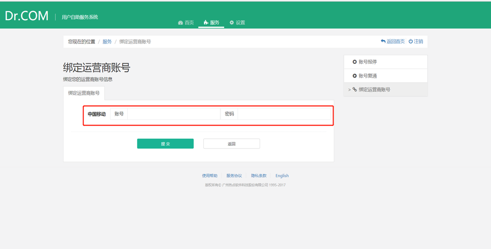
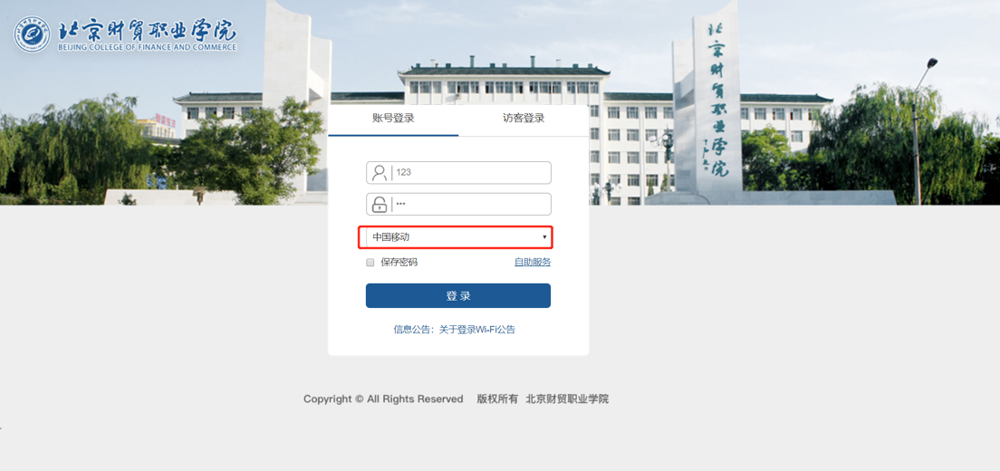
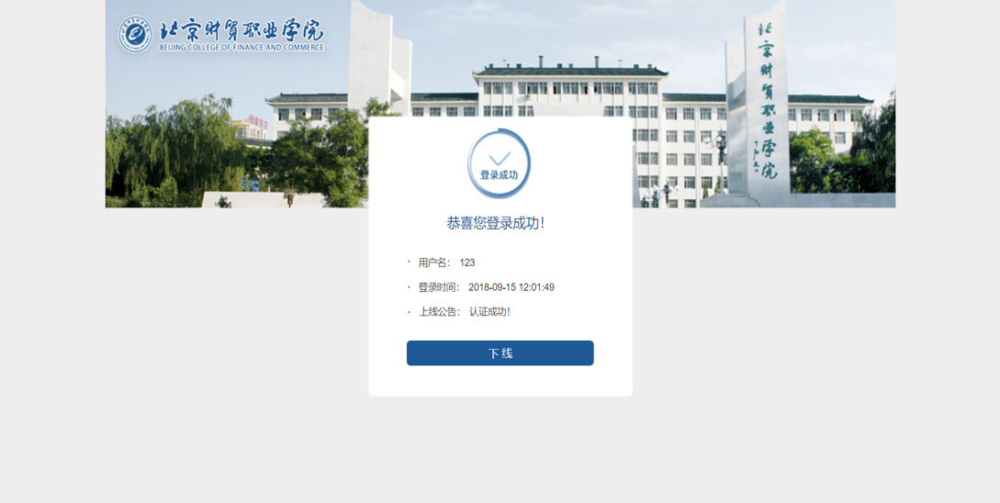

## 北京财贸职业学院 融合认证步骤

- **第1步** 首先看登陆页面

- **第2步** 用户第一次登陆用校园网账号

- **第3步** 点击登陆后校园网认证成功

- **第4步** 用户如果要用移动宽带账号上网，第一次必须点击登陆页面上的自助服务链接

- **第5步** 这时会跳转至用户自助服务登陆界面，如果没有宽带账号，请扫描公告里的二维码或打电话报装

- **第6步** 用校园网账号登陆自助服务，首页上方点击服务

- **第7步** 点击后会有一个绑定运营商账号

- **第8步** 进去之后输入自己的移动宽带账号和密码点击提交后，表示校园网账号和移动贷带宽账号绑定成功

- **第9步** 这时在登陆界面里写自己校园网账号和密码后选择下方的中国移动，点击登陆

- **第10步** 这时的登陆成功表示学生自己的校园网账号对应的移动带宽账号上线成功

