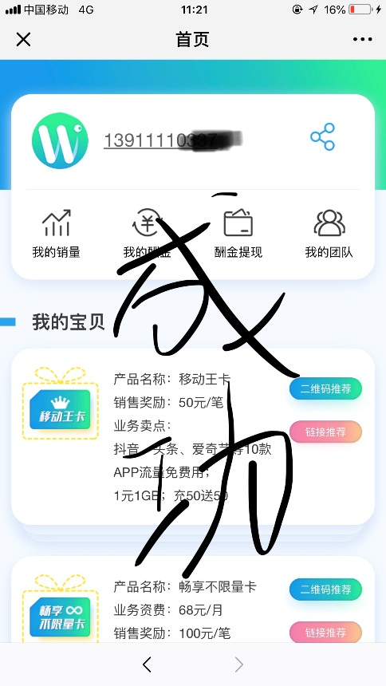

## 云微盟 注册流程

- **第1步** 在微信平台中搜索“云微盟”公众号

- **第2步** 关注“云微盟”公众号

- **第3步** 输入手机号，获取验证码

- **第4步** 输入验证码，点击下一步

- **第5步** 基本信息可跳过

- **第6步** 成功

- **第7步** 进入宽带办理界面

- **第8步** 输入手机号进行验证

- **第9步** 选择安装地址

- **第10步** 选择套餐并提交

- **第11步** 输入短信验证码报装成功

